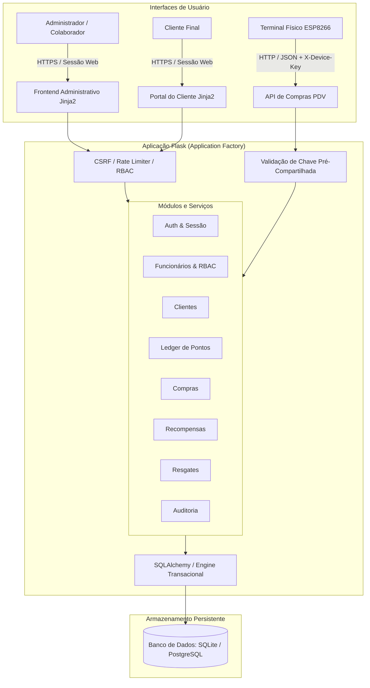

# FideliZa — Sistema Integrado de Fidelização, Gestão Administrativa & IoT

[](https://github.com/iasmim-almeida/sistema-fidelizacao-arduino/actions)


O **FideliZa** é um sistema completo de fidelização de clientes e gestão de loja física, desenvolvido no âmbito acadêmico de Trabalho de Conclusão de Curso (TCC). O projeto combina uma plataforma web administrativa moderna com controle de acesso baseado em papéis (**RBAC**), portal de autoatendimento para clientes, extrato transacional de pontos (**Ledger Imutável**), catálogo e resgate transacional de recompensas com controle de concorrência, auditoria de segurança e integração via hardware embarcado (**ESP8266**).

---

## 1. Problema Resolvido

Muitos estabelecimentos comerciais físicos enfrentam dificuldades para reter clientes e gerenciar programas de recompensas de forma segura:
- Cartões de fidelidade físicos em papel são facilmente fraudados, perdidos ou esquecidos;
- Sistemas improvisados não possuem integridade contábil nas transações de pontos, facilitando manipulações indevidas;
- Falta de hierarquia entre colaboradores permite que operadores realizem ações críticas sem autorização;
- Ausência de rastreabilidade e logs de auditoria impossibilita identificar fraudes ou erros de caixa.

O **FideliZa** resolve esses desafios centralizando a gestão de clientes, compras, pontuações, funcionários e recompensas em uma aplicação segura, auditável e integrada diretamente ao caixa (PDV e terminal IoT).

---

## 2. Recursos e Funcionalidades

### 👥 Hierarquia de Colaboradores & RBAC (Role-Based Access Control)
- **Proprietário / Administrador:** Acesso irrestrito a todos os módulos (dashboard, clientes, equipe, recompensas, resgates, relatórios, auditoria e configurações).
- **Gerente:** Gestão operacional de clientes, ajuste de pontos, catálogo de recompensas, entrega de prêmios e relatórios de vendas.
- **Vendedor:** Operação ágil de PDV (pesquisa e auto-cadastro de clientes, pontuação de compras e validação de resgates). Protegido contra escalada de privilégios.
- Desativação suave (**soft disable**) de colaboradores impedindo login imediato de contas inativas.

### 🛍️ Gestão Completa de Clientes
- Cadastro de clientes no balcão e portal de auto-cadastro com proteção anti-CSRF;
- Busca instantânea por nome, telefone ou e-mail, com filtros por status e faixa de pontos;
- Perfil detalhado com histórico de visitas, total gasto, recompensas resgatadas e extrato de movimentações;
- Desativação temporária (**soft delete**) preservando a integridade do histórico financeiro e de pontos.

### 🪙 Ledger Imutável de Pontos & Ajuste Manual Seguro
- Registro contábil completo de cada alteração de saldo através da entidade `MovimentacaoPontos`;
- Tipos de movimentação: `COMPRA`, `RESGATE`, `AJUSTE_POSITIVO`, `AJUSTE_NEGATIVO`, `ESTORNO` e `EXPIRACAO`;
- Bloqueio pessimista de linha (`with_for_update`) prevenindo *race conditions* em compras ou ajustes simultâneos;
- Ajuste manual com justificativa obrigatória registrada para auditoria e impedimento de saldo negativo.

### 🎁 Recompensas & Resgates Transacionais
- Criação e gestão de prêmios: produtos físicos, desconto percentual (%) e desconto em valor fixo (R$);
- Controle atômico de estoque, validade e custo em pontos com `CheckConstraint` no banco de dados;
- Resgate seguro com atualização síncrona do saldo do cliente e estoque da recompensa; reversão completa (*rollback*) em caso de falha;
- Catálogo no portal do cliente com bloqueio visual claro para itens com pontos insuficientes.

### 🛡️ Trilha de Auditoria Administrativa
- Registro persistente de eventos críticos: logins, logouts, troca de senha, criação/edição de funcionários, alteração de status, ajustes manuais de pontos e validação de resgates;
- Sanitização estrita: senhas, hashes, chaves de API e tokens **nunca** são persistidos nos logs;
- Interface de consulta paginada com filtros por operador, ação, entidade e período.

### 📊 Dashboard & Métricas Acadêmicas de TCC
- Indicadores em tempo real: clientes totais e ativos, pontos emitidos e em circulação, faturamento pontuado e prêmios entregues;
- Fórmulas analíticas do modelo de retenção (Meili, 2022):
  - **Taxa de Recorrência:** Média de compras por cliente cadastrado;
  - **Rotatividade (Churn Adaptativo):** Percentual de clientes sem compras nos últimos 30 dias;
  - **Taxa de Resgate (Redemption Rate):** Proporção de pontos emitidos que foram convertidos em benefícios.

### ⚡ Integração IoT (ESP8266)
- Firmware em C++ para microcontrolador ESP8266;
- Registro de compras via API HTTP/JSON com autenticação por chave pré-compartilhada (`X-Device-Key`);
- Feedback visual com LED para confirmação de transação bem-sucedida.

---

## 3. Arquitetura do Sistema



---

## 4. Stack Tecnológica

| Camada | Tecnologias |
|---|---|
| **Backend** | Python 3.12, Flask 3.1, Flask-Login, Flask-WTF, Flask-Limiter, Werkzeug |
| **Banco de Dados** | SQLAlchemy 2.0, Flask-Migrate (Alembic), SQLite3 (Dev/Test), PostgreSQL (Prod) |
| **Frontend** | Jinja2 Server-Side Rendering, Bootstrap 5.3, FontAwesome 6, Chart.js, Fetch API |
| **Segurança** | PBKDF2 Password Hashing, CSRFProtect, Content Security Policy (CSP), Session Hijacking Defense |
| **IoT / Hardware** | Microcontrolador ESP8266 (ESP-12E / NodeMCU), C++, Arduino Core |
| **CI / DevOps** | GitHub Actions, Git, Python compileall, Unittest |

---

## 5. Estrutura do Diretório

```text
sistema-fidelizacao-arduino/
├── app/
│   ├── __init__.py               # Application Factory, extensões, cabeçalhos de segurança
│   ├── config.py                 # Configurações de ambiente (Dev, Test, Prod)
│   ├── extensions.py             # Instâncias db, login_manager, csrf, limiter, migrate
│   ├── forms.py                  # Formulários Flask-WTF e validações de senha
│   ├── models/                   # Modelos de dados SQLAlchemy
│   │   ├── auditoria.py          # Entidade de trilha de auditoria
│   │   ├── cliente.py            # Entidade do cliente (com soft delete)
│   │   ├── compra.py             # Registro de compras e pontuações
│   │   ├── movimentacao_pontos.py# Ledger imutável de transações de pontos
│   │   ├── recompensa.py         # Catálogo com estoque e regras de benefício
│   │   ├── resgate.py            # Registro atômico de entregas de prêmios
│   │   └── usuario.py            # Colaboradores (Admin, Gerente, Vendedor)
│   ├── routes/                   # Blueprints e controladores web e REST
│   │   ├── auditoria.py          # Endpoints de consulta a logs
│   │   ├── auth.py               # Login, logout, auto-cadastro e troca de senha
│   │   ├── clientes.py           # Gestão de clientes, ajustes de pontos e extrato
│   │   ├── compras.py            # Registro de compras PDV e IoT
│   │   ├── funcionarios.py       # CRUD de colaboradores e RBAC
│   │   ├── main.py               # Rotas das páginas web e dashboard
│   │   ├── recompensas.py        # Catálogo administrativo de prêmios
│   │   └── resgates.py           # Entrega transacional de benefícios
│   └── services/                 # Lógica de negócio e utilitários transversais
│       ├── auditoria.py          # Serviço seguro de sanitização e log
│       ├── pontos.py             # Ledger transacional com lock pessimista
│       └── rbac.py               # Matriz de papéis, permissões e decorators
├── arduino/                      # Firmware C++ para o ESP8266
├── database/scripts_sql/         # Schema PostgreSQL equivalente para provisionamento manual
├── docs/                         # Documentações técnicas e especificações de TCC
├── frontend/
│   ├── static/css/style.css      # Folha de estilo compartilhada do FideliZa
│   └── templates/                # Páginas Jinja2
│       ├── base_vendedora.html   # Layout base da área administrativa
│       ├── base_clientes.html    # Layout base do portal do cliente
│       ├── login.html            # Tela unificada de autenticação
│       ├── cadastro.html         # Tela de auto-cadastro do cliente
│       ├── clientes/             # Visões do cliente (Dashboard, Extrato, Catálogo)
│       └── vendedora/            # Visões administrativas (Clientes, Funcionários, Auditoria, etc.)
├── migrations/                   # Versões de migração Alembic
├── tests/                        # Suíte abrangente de testes automatizados (83 testes)
├── .env.example                  # Variáveis de ambiente de exemplo
├── .gitignore                    # Regras de exclusão do Git
├── requirements.txt              # Dependências Python do projeto
├── run.py                        # Ponto de entrada da aplicação
├── seed.py                       # Script de carga inicial para demonstração
└── test_security_audit.py        # Suíte de verificação de segurança (SAST/DAST local)
```

---

## 6. Modelo de Permissões (RBAC)

O sistema implementa uma matriz de autorização centralizada em [`app/services/rbac.py`](app/services/rbac.py):

| Permissão | Descrição | Proprietário | Gerente | Vendedor |
|---|---|:---:|:---:|:---:|
| `clientes.visualizar` | Consultar clientes e extratos | ✅ | ✅ | ✅ |
| `clientes.criar` | Cadastrar novos clientes no PDV | ✅ | ✅ | ✅ |
| `clientes.editar` | Alterar dados cadastrais de clientes | ✅ | ✅ | ❌ |
| `clientes.desativar` | Ativar/desativar conta de cliente | ✅ | ✅ | ❌ |
| `pontos.visualizar` | Consultar saldos e movimentações | ✅ | ✅ | ✅ |
| `pontos.adicionar` | Creditar pontos e compras | ✅ | ✅ | ✅ |
| `pontos.remover` | Estornar ou debitar pontos manualmente | ✅ | ✅ | ❌ |
| `funcionarios.visualizar` | Listar equipe e dados cadastrais | ✅ | ❌ | ❌ |
| `funcionarios.criar` | Cadastrar novos colaboradores | ✅ | ❌ | ❌ |
| `funcionarios.editar` | Editar colaboradores e redefinir senhas | ✅ | ❌ | ❌ |
| `funcionarios.desativar` | Ativar/desativar colaboradores | ✅ | ❌ | ❌ |
| `recompensas.visualizar` | Consultar catálogo de recompensas | ✅ | ✅ | ✅ |
| `recompensas.criar` | Criar novas recompensas | ✅ | ✅ | ❌ |
| `recompensas.editar` | Editar catálogo e estoque | ✅ | ✅ | ❌ |
| `recompensas.desativar` | Pausar e reativar recompensas | ✅ | ✅ | ❌ |
| `resgates.validar` | Entregar e debitar prêmios | ✅ | ✅ | ✅ |
| `relatorios.visualizar` | Visualizar métricas e faturamento | ✅ | ✅ | ❌ |
| `auditoria.visualizar` | Consultar logs administrativos | ✅ | ❌ | ❌ |

---

## 7. Como Executar (Linux / WSL / macOS)

### Pré-requisitos
- Python 3.12 ou superior instalado;
- Git instalado.

### Passo 1: Clonar e entrar no diretório
```bash
git clone https://github.com/iasmim-almeida/sistema-fidelizacao-arduino.git
cd sistema-fidelizacao-arduino
```

### Passo 2: Criar e ativar o ambiente virtual
```bash
python3 -m venv .venv
source .venv/bin/activate
```

### Passo 3: Instalar as dependências
```bash
pip install --upgrade pip
pip install -r requirements.txt
```

### Passo 4: Configurar as variáveis de ambiente
```bash
cp .env.example .env
```
*(Opcional: edite o `.env` para ajustar `SECRET_KEY` ou `IOT_DEVICE_KEY`).*

### Passo 5: Executar as migrações do banco de dados
```bash
flask --app run.py db upgrade
```

### Passo 6: (Opcional) Popular com dados de demonstração
> ⚠️ **Atenção:** O comando `python seed.py` é destrutivo e recria a base para demonstração do TCC.
```bash
python seed.py
```

### Passo 7: Iniciar o servidor de desenvolvimento
```bash
FLASK_ENV=development python run.py
```
Acesse a aplicação em: **`http://127.0.0.1:5000`**

---

## 8. Credenciais de Demonstração (após `seed.py`)

| Perfil | E-mail / Usuário | Senha | Destino Inicial |
|---|---|---|---|
| **Proprietário (Admin)** | `admin@loja.com` *(ou `admin`)* | `FideliZa2026` | `/dashboard` |
| **Gerente** | `gerente@loja.com` *(ou `gerente`)* | `FideliZa2026` | `/dashboard` |
| **Vendedor** | `vendedora@loja.com` *(ou `vendedora`)* | `FideliZa2026` | `/dashboard` |
| **Cliente Exemplo (Ana)** | `11999991111` | `FideliZa2026` | `/bemvindo` |
| **Cliente Exemplo (Carlos)** | `11988882222` | `FideliZa2026` | `/bemvindo` |

---

## 9. Testes Automatizados e Qualidade

O sistema conta com suíte de testes automatizados com 100% de aprovação:

```bash
# 1. Executar testes unitários e de integração (83 testes)
python -m unittest discover -s tests -v

# 2. Executar auditoria de segurança (SAST / DAST local)
DATABASE_URL="sqlite:///:memory:" python test_security_audit.py

# 3. Validar consistência do esquema do banco com as Migrations
flask --app run.py db check

# 4. Validar compilação limpa do código
python -m compileall -q app migrations tests run.py seed.py test_security_audit.py
```

---

## 10. Contexto Acadêmico (TCC)

Este projeto foi concebido e implementado como Trabalho de Conclusão de Curso (TCC), demonstrando a aplicação prática de conceitos avançados da Engenharia de Software:
- Arquitetura em camadas com separação clara de responsabilidades;
- Padrões de projeto: Application Factory, Blueprints, Service Layer, Repository Pattern via ORM;
- Transações atômicas ACID e prevenção de concorrência com bloqueio pessimista;
- Segurança da informação aderente às recomendações da OWASP (Top 10): defesa contra Broken Access Control, Injection, CSRF, IDOR e Session Collision;
- Integração de sistemas físicos e digitais por meio de computação ubíqua e Internet das Coisas (IoT).

---

## 11. Licença

Este projeto é disponibilizado sob a licença [MIT](LICENSE).
